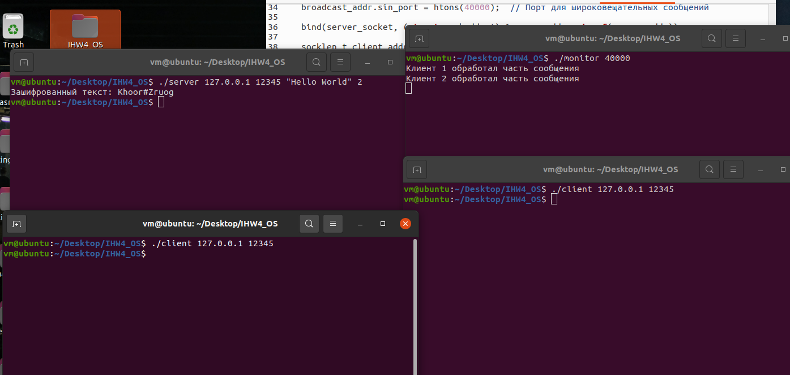

# Индивидуальное домашнее задание №4 по операционным системам

## Выполнил студент группы БПИ-219, Котовский Семён Олегович

### Вариант 33.

### Задание

Реализовать приложение, шифрующее исходный текст, где каждой букве латинского алфавита соответствует число. Каждый
процесс–шифровальщик шифрует свои кусочки текста, получаемые от менеджера. Распределение фрагментов текста между
процессами осуществляется процессом–менеджером, который передает каждому процессу участок текста, получает от него
результат, передает следующий незашифрованный фрагмент. Он же собирает из отдельных фрагментов зашифрованный текст.

### Описание решения с клиентом и сервером:

Сервер и клиенты реализованы как отдельные приложения. Сервер принимает сообщения от клиентов, шифрует их и отправляет
обратно клиентам. Все это происходит через UDP соединение.

### Описание решения с клиентом, сервером и монитором:

Была добавлена третья программа - монитор, который подключается к серверу и отслеживает процесс обработки сообщений.
Сервер при каждом завершении обработки фрагмента сообщения отправляет широковещательное сообщение, которое принимает
монитор и выводит на экран.

### Инструкция по компиляции и запуску:

1. Компиляция программ:

```
gcc -o server server.c
gcc -o client client.c
gcc -o monitor monitor.c
```

2. Запуск сервера:

```
./server <IP-адрес> <порт> <текст> <количество клиентов>
```

3. Запуск клиентов:

```
./client <IP-адрес сервера> <порт сервера>
```

Запустите столько клиентов, сколько было указано при запуске сервера.

5. Запуск монитора:

```
./monitor <IP-адрес сервера> <широковещательный порт> (по умолчанию 40000)
```

### Примеры входных и выходных данных:

Входные данные:

    Сервер: 
    ./server 127.0.0.1 8080 "Hello World" 2

    Клиент 1: 
    ./client 127.0.0.1 8080

    Клиент 2: 
    ./client 127.0.0.1 8080

    Монитор: 
    ./monitor 127.0.0.1 8080

Выходные данные:

    Сервер: 
    Зашифрованный текст: Khoor Zruog

    Монитор:
    Клиент 1 обработал часть сообщения
    Клиент 2 обработал часть сообщения

### Описание технической реализации

#### 1. Сервер

   Сервер создает UDP сокет и привязывается к определенному IP-адресу и порту. Затем он разбивает входной текст на
   равные фрагменты и начинает слушать входящие соединения от клиентов. Когда клиент подключается, сервер отправляет ему
   фрагмент текста для шифрования и получает обратно зашифрованный фрагмент. Этот процесс повторяется, пока все
   фрагменты текста не будут зашифрованы. После шифрования всех фрагментов, сервер объединяет их и выводит зашифрованный
   текст.

   После обработки каждого фрагмента текста, сервер также отправляет широковещательное сообщение с информацией о
   завершении обработки фрагмента.
#### 2. Клиент

   Клиент создает UDP сокет и подключается к серверу. Затем он получает от сервера фрагмент текста для шифрования,
   выполняет шифрование и отправляет обратно зашифрованный фрагмент. После этого клиент завершает свою работу.
#### 3. Монитор

   Монитор создает UDP сокет и подключается к серверу. Затем он начинает слушать входящие широковещательные сообщения от
   сервера и выводит их на экран.

### Пример работы программ:

